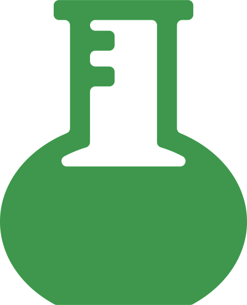

 

      

#  **About me**

 

Hello!
I'm Wassim, an AI/ML Engineer enhancing business growth through technology at Mabbly in Chicago.
With a strong background in Machine learning, Large Language Models,
and fine-tuning AI applications, I excel in turning cutting-edge AI theories into practical, market-ready solutions.

🔍 What I Do:
I specialise in implementing AI solutions that drive innovation, efficiency, and growth.

🌐 Let's Connect!
I'm always open to discussing AI innovations and potential collaborations. If you're interested in leveraging AI for
business growth or need a partner for your AI initiatives.

#  **Skills**

 

###  **AI/ML**

  

 

###  **Web Development**

  

 

###  **DevOps & LLMOps**

  

 

###  **Databases**

  

 

#  **Statistics**

 

#  **Connect with me**

