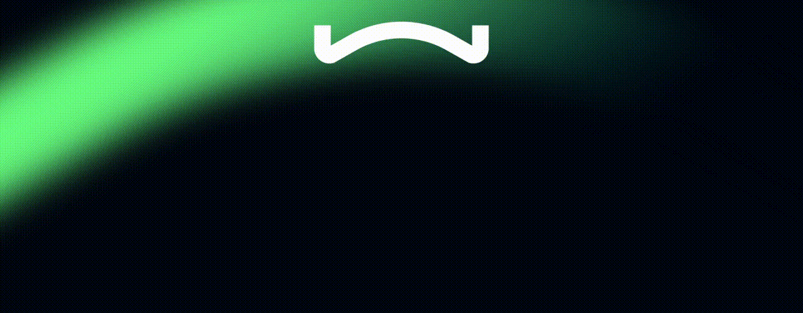

 

TODO : my description

   

      
   

---

### 🧰 Languages and Tools
 

 

#

### 📊 Stats
#

### 📊 Connect with me
#

  
  &#8287;&#8287;&#8287;&#8287;&#8287;
  
  &#8287;&#8287;&#8287;&#8287;&#8287;
  
  &#8287;&#8287;&#8287;&#8287;&#8287;
  
  &#8287;&#8287;&#8287;&#8287;&#8287;
  
  &#8287;&#8287;&#8287;&#8287;&#8287;

  

#

[website]: https://fkcodes.com
